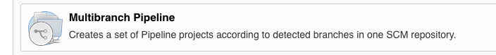

# apigee-apickli-apimocker-demo

This repository demo's apickli, Apigee Maven deployment plugin, Apigee Maven config plugin, Apigee Hosted Targets and Jenkins Pipeline.


## Deployment

1. Clone this repository.
```
git clone https://github.com/swilliams11/apigee-apickli-apimocker-demo.git
```

2. CD into the directory where you cloned the repository and deploy all the proxies.

```
cd apigee-apickli-apimocker-demo

```

3. Deploy all services and configuration data.  This deploy script will not run any tests.

```
./deploy.sh $APIGEE_ORG $APIGEE_ENV $APIGEE_UNAME $APIGEE_PW
```

e.g.
```
./deploy.sh demo-org test username@gmail.com SeCret531
```


## Other information

* Deploy the configuration to Apigee (developer, app and API product).
```
cd ~/Github/apigee-apickli-apimocker-demo/config/org
mvn install -Ptest -Dapigee.username=$APIGEE_UNAME -Dorg=$APIGEE_ORG -Denv=$APIGEE_ORG -Dapigee.password=$APIGEE_PW -Dapigee.config.options=create -Dapigee.config.file=edge.json
```

* Skip tests and deploy proxy only
```
 mvn install -Dapigee.username=$APIGEE_UNAME -Dapigee.org=$APIGEE_ORG -Dapigee.env=$APIGEE_ENV -Dapigee.password=$APIGEE_PW -DskipTests=true
```

* Run tests only
```
mvn install -Dapigee.org=$APIGEE_ORG -Dapigee.env=$APIGEE_ENV -DskipDeployment=true
```

## Jenkins
### Jenkins Configuration
You must configure Jenkins as outline below.
* [pipeline plugin](https://wiki.jenkins.io/display/JENKINS/Pipeline+Plugin)
* You should configure Maven, Java and NodeJS in Jenkins Global Configuration.

Once you install the pipeline plugin and add Maven, Java and NodeJS as global tools, then you can create a new pipeline.  


#### signup proxy
1. Branch sources
* Project Repository: https://github.com/swilliams11/apigee-apickli-apimocker-demo.git
* Credentials: enter your credentials to Github if required

2. Build Configuration
* Mode: by Jenkinsfile
* script Path: signup/Jenkinsfile

3. Scan Multibranch Pipeline triggers [OPTIONAL]
* select `Periodically if not otherwise run`
* Interval: 1 day


#### auth proxy
1. Branch sources
* Project Repository: https://github.com/swilliams11/apigee-apickli-apimocker-demo.git
* Credentials: enter your credentials to Github if required

2. Build Configuration
* Mode: by Jenkinsfile
* script Path: auth/Jenkinsfile

3. Scan Multibranch Pipeline triggers [OPTIONAL]
* select `Periodically if not otherwise run`
* Interval: 1 day

#### mockbackend proxy
1. Branch sources
* Project Repository: https://github.com/swilliams11/apigee-apickli-apimocker-demo.git
* Credentials: enter your credentials to Github if required

2. Build Configuration
* Mode: by Jenkinsfile
* script Path: mockbackend/Jenkinsfile

3. Scan Multibranch Pipeline triggers [OPTIONAL]
* select `Periodically if not otherwise run`
* Interval: 1 day


### Jenkins Pipeline
The Jenkins pipeline has the following parameters:
* APIGEE_ORG
* APIGEE_ENV
* SKIP_DEPLOYMENT - default is false; if you only want to execute Apickli tests, then set this value to true.
* APIGEE_API_CREDENTIALS - should be set to the base64encoded(client_id:secret)
  This should be set if your API requires an access token.
